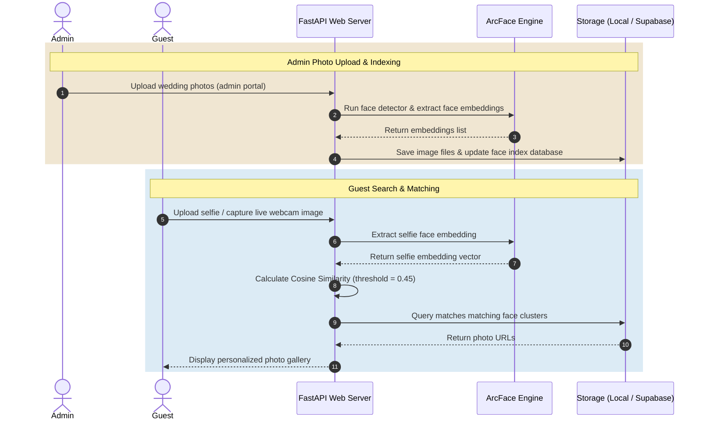

<div align="center">

<!-- Logo -->


<!-- Animated Typing Subtitle -->
<h1>
  <a href="https://git.io/typing-svg">
    
  </a>
</h1>

<p><em>An elegant, high-performance face recognition system designed to capture, organize, and instantly share wedding memories with guests.</em></p>

<!-- Technology Badges -->
<p>
  
  
  
  
  
  
</p>

<p>
  
  
  
</p>

---

</div>

## 📖 Overview

**Techora Memories** bridges the gap between wedding photographers and guests. Instead of scrolling through thousands of photos in a massive shared folder, guests simply upload a selfie to instantly find and download every wedding photo they appear in. 

Built with a luxury, dark-gold aesthetic, the system supports both offline **local events** (using local network hotspots or instant Cloudflare secure tunnels) and **global cloud sync** via Supabase.

---

## ✨ Key Features

*   **🤖 Neural Face Recognition:** Uses the state-of-the-art **ArcFace ResNet-50** deep learning model (via `uniface`) to detect and match guest faces with extreme accuracy.
*   **💾 Dual-Storage Engine:**
    *   **Local Mode:** Completely offline, saves database records to `database.json` and photos to a local disk folder.
    *   **Supabase Mode:** Syncs database records to PostgreSQL and uploads photos to Supabase Storage Buckets.
*   **🌐 Instant Public Access (Tunnels):** Expose your offline local server globally during the event with **Cloudflare Tunnels** or **ngrok** directly from the startup CLI, enabling guests to connect using their phone data without joining local Wi-Fi.
*   **📶 Wi-Fi Broadcast Mode:** Broadcast the service over a local Wi-Fi router or custom laptop hotspot. Guests connect instantly by entering the local LAN IP address or scanning a QR code.
*   **🖥️ Windows Desktop App & Console:** Features a beautiful Tkinter-based loader (`WeddingSystem.exe`) and an interactive cyberpunk-themed PowerShell console (`start.ps1`) to orchestrate tunnels, change storage modes, and sync databases.
*   **🔒 Consent & Social Integration:** Guests can opt-in to register their name, consent to photo searches, and link their social handles (Instagram, WhatsApp).

---

## 🛠️ System Architecture

The workflow details the lifecycle of photos (uploaded by Admins) and guest selfies (uploaded by attendees to retrieve matching photos):



---

## 🚀 Getting Started (Hosts / Operators)

If you are hosting or operating the system at a wedding venue, you can launch it using our automated tools:

### Option 1: Double-Click Launcher (Windows)
1. Run [WeddingSystem.exe](./WeddingSystem.exe) to start the system.
2. The launcher will spin up the backend FastAPI server in the background and open the **Admin Dashboard** in a dedicated Chrome/Edge app window automatically.

### Option 2: Cyberpunk PowerShell CLI (Recommended)
1. Run [start.bat](./start.bat) (or run `./start.ps1` in PowerShell).
2. Choose your active storage system:
   * **[1] Local Disk Mode** (Offline)
   * **[2] Supabase Cloud Mode** (Cloud DB + Bucket Sync)
3. Choose your deployment environment:
   * **[1] Guest Portal:** Access locally on `http://localhost:8000`.
   * **[2] Cloudflare Matrix:** Instantly exposes the guest portal via a secure public URL (`*.trycloudflare.com`). No configuration needed!
   * **[3] Ngrok Tunnel:** Expose globally using your personal Ngrok token.
   * **[4] Admin Dashboard:** Open management UI.
   * **[5] Wi-Fi Broadcast:** Broadcast interface on your local LAN network.

---

## 💻 Developer Setup & Running locally

To install dependencies and start the codebase in developer mode:

### 1. Clone the Repository
```bash
git clone https://github.com/hanankalathil/Wedding-face-recognisation-system.git
cd Wedding-face-recognisation-system
```

### 2. Configure Environment Variables
Create a `.env` file in the root directory (based on `.env` template):
```env
# Storage Mode (local / supabase)
STORAGE_MODE=local

# Supabase Credentials (Required if STORAGE_MODE=supabase)
SUPABASE_URL=https://your-project.supabase.co
SUPABASE_SERVICE_ROLE_KEY=your-supabase-service-role-key
SUPABASE_STORAGE_BUCKET=wedding-gallery

# Admin Configurations
ADMIN_EMAILS=admin@techora.com,host@wedding.com
```

### 3. Setup Python Virtual Environment
```bash
python -m venv venv
venv\Scripts\activate      # On Windows
source venv/bin/activate   # On macOS/Linux
```

### 4. Install Dependencies
```bash
pip install -r requirements.txt
```

### 5. Launch Developer Server
```bash
python backend/run.py
```
* The backend server runs at `http://localhost:8000`.
* The frontend files are served statically from the `/frontend` directory. Open `http://localhost:8000/index.html` (Guest portal) or `http://localhost:8000/admin` (Admin dashboard).

---

## ☁️ Cloud Deployment

This repository is ready to be hosted in the cloud for remote weddings or online portals:

### ⚡ Deploy to Vercel (Serverless)
The codebase includes [vercel.json](./vercel.json) to deploy the FastAPI backend serverlessly alongside the static frontend.
1. Install Vercel CLI: `npm install -g vercel`
2. Run `vercel` in the root folder.
3. Configure your Environment Variables (`SUPABASE_URL` and `SUPABASE_SERVICE_ROLE_KEY` are **required** since Vercel's serverless file system is read-only).

### 🐳 Deploy to Render (Persistent VM)
The project includes a [Dockerfile](./Dockerfile) and [render.yaml](./render.yaml) for easy deployment with persistent local disk storage.
1. Connect your GitHub repository to Render.
2. Render will automatically detect `render.yaml` and provision a Web Service with a persistent disk attached to `/data` to store database and galleries offline without requiring Supabase.

---

## ⚙️ How Face Recognition Works Under the Hood

1. **Face Detection:** When an admin uploads photos, the engine uses OpenCV to locate face boundaries.
2. **Embedding Extraction:** **ArcFace (ResNet-50)** processes each crop to generate a 512-dimensional vector embedding representing the unique features of the face.
3. **Storage / Indexing:** Embeddings are grouped into folders representing unique persons under the gallery directory.
4. **Selfie Querying:** When a user uploads their selfie, its 512-dimensional vector is compared to all indexed face clusters in the database using **Cosine Similarity**:
   $$\text{Similarity} = \frac{\mathbf{A} \cdot \mathbf{B}}{\|\mathbf{A}\| \|\mathbf{B}\|}$$
5. **Threshold Match:** If the similarity score is greater than **`0.45`**, it is flagged as a match, and the associated photos are loaded into the guest's personalized page.

---

## 🤝 Contributing

Contributions to improve matching speed, UI animations, or adding new cloud adapters are welcome!
1. Fork the Project.
2. Create your Feature Branch (`git checkout -b feature/AmazingFeature`).
3. Commit your Changes (`git commit -m 'Add some AmazingFeature'`).
4. Push to the Branch (`git push origin feature/AmazingFeature`).
5. Open a Pull Request.

---

<div align="center">
  <p>Made with ❤️ by <a href="https://github.com/hanankalathil">hanankalathil</a></p>
</div>
